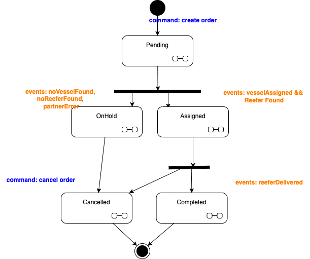
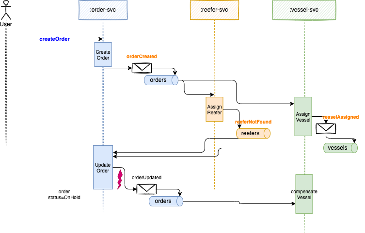
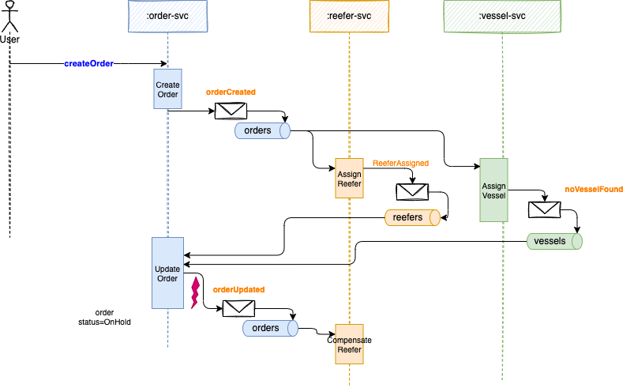

# Saga Orchestration with Kafka Demonstration

## Context

Introduced in 1987 [by Hector Garcaa-Molrna Kenneth Salem paper](https://www.cs.cornell.edu/andru/cs711/2002fa/reading/sagas.pdf) the Saga pattern helps to support a long running transaction that can be broken up to a collection of sub transactions which can be interleaved any way with other transactions.

With microservice each transaction updates data within a single service, each subsequent steps may be triggered by previous completion. 

## Demonstration scope

The Saga choreography implementation is based on a fictious fresh content shipping business process, to send fresh food to remote location using refrigerated container on vessels.

The Choreography variant of the SAGA pattern, done with Kafka, involves strong decoupling between services, and each participant listens to facts from other services and acts on them independently. So each service will have at least one topic representing states on its own entity. In the figure below the saga is managed in the context of the order microservice in one of the business function like `createOrder`.

{ width="900" }

The figure above illustrates that each service uses its own Kafka topic to keep events about state changes for their own business entity. 

To manage the saga the `Order service` needs to listen to all participants topics and correlates event using the order ID as key.

The Order business entity in this service supports a simple state machine as defined below:



Each state transition should generate an event to the orders topic.

The happy path looks like in the following sequence diagram:


In this scenario, we have a long running transaction that spans across the Order microservice which creates the order and maintains the Order states, the Reefer manager microservice which tries to find an empty refrigerator container with enough capacity in the origin port to support the order, the Vessel microservice which tries to find a boat from the origin port to the destination port with enough capacity for the refrigerator containers.

As you can see in the diagram above, the transaction does not finish until a reefer has been allocated and a vessel is assigned to the order and, as a result, the order stays in pending state until all the sub transactions have successfully finished.

## Code repository

The implementation of the services are done with Quarkus and Microprofile Messaging.

Each code structure is based on the domain-driven-design practice with clear separation between layers (app, domain, infrastructure) and keep the domain layer using the ubiquituous language of each domain: order, reefer, and vessel.

```
       └── order
           ├── app
           │   └── OrderCommandApplication.java
           ├── domain
           │   ├── Address.java
           │   ├── OrderService.java
           │   └── ShippingOrder.java
           └── infra
               ├── api
               │   ├── ShippingOrderResource.java
               │   └── VersionResource.java
               ├── events
               │   ├── EventBase.java
               │   ├── order
               │   │   ├── OrderCreatedEvent.java
               │   │   ├── OrderEvent.java
               │   │   ├── OrderEventProducer.java
               │   │   ├── OrderUpdatedEvent.java
               │   │   └── OrderVariablePayload.java
               │   ├── reefer
               │   │   ├── ReeferAgent.java
               │   │   ├── ReeferAllocated.java
               │   │   ├── ReeferEvent.java
               │   │   ├── ReeferEventDeserializer.java
               │   │   └── ReeferVariablePayload.java
               │   └── vessel
               │       ├── VesselAgent.java
               │       ├── VesselAllocated.java
               │       ├── VesselEvent.java
               │       ├── VesselEventDeserializer.java
               │       └── VesselVariablePayload.java
               └── repo
                   ├── OrderRepository.java
                   └── OrderRepositoryMem.java
```

Events are defined in the infrastructure level, as well as the JAX-RS APIs.

### Compensation

The SAGA pattern comes with the tradeoff that a compensation process must also be implemented in the case that one, or multiple, of the sub transactions fails or does not complete so that the system rolls back to the initial state before the transaction began.

In our specific case, a new order creation transaction can fail either because we can not find a refrigerator container to be allocated to the order or we can not find a boat to assigned to the order.

Most likely a compensation may involve a human to continue the process, or more complex business rules based, inference engine to do the appropriate actions to handle the order onHold.

### No reefer



When a new order creation is requested by a customer but there is no refrigerator container to be allocated to such order, either because the container(s) do not have enough capacity or there is no container available in the origin port for such order, the compensation process for the order creation transaction is quite simple. The order microservice will not get an answer from the reefer manager, and after a certain time, it will trigger the compensation flow by sending a OrderUpdate with status onHold. The vessel service which may has responded positively before that, may roll back the order to vessel allocation relationship.

### No vessel



This case is the sysmetric of the other one. The actions flow remains as expected for the SAGA transaction until the Vessel microservice is not answering after a time period or answering negatively. As a result, the Order Command microservice will transition the order to `OnHold` and emit an OrderUpdateEvent to inform the saga participants. In this case, the Reefer manager is one of those interested party, as it will need to kick off the compensation task, which in this case is nothing more than de-allocate the container to the order to make it available for any other coming order.

## Demonstration

In this repository, we have define a docker compose file that let you run the demonstration on your local computer. You need podman or docker and docker compose.

```sh
docker-compose up -d
```

The following containers are running:

```
```


