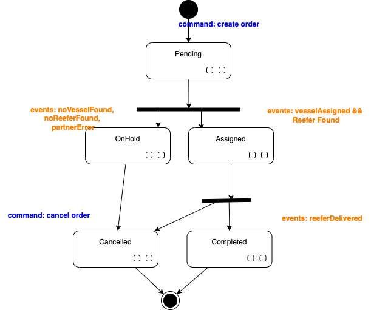

# Order Management service

A simple order management service to manage order to ship fresh content between countries. The order follows a state machine to control its life cycle and create events about it state changes.

When created the state of the order is pending, then once it got a refrigerator container and a vessel both assigned, then it goes to assigned.



Any problem in the process should move the order onhold state.

## Running the application in dev mode

You can run your application in dev mode that enables live coding using:

```shell script
docker compose up -d
# Then
./mvnw compile quarkus:dev
```

* Send new order with curl using `e2e/sendOrder.sh` script, and verify in Kafdrop `orders` topic an event is created, like:

```json
{
   "timestampMillis": 1695077619882,
   "eventType": "OrderCreated",
   "version": "1.0.0",
   "orderID": "b485e2a6-521c-4c99-9f7d-a0640b36e433",
   "productID": "P01",
   "customerID": "C01",
   "quantity": 10,
   "status": "pending",
   "payload": {
      "destinationCity": "Hong Kong",
      "pickupCity": "San Francisco",
      "pickupDate": "2023/9/1",
      "expectedCapacity": 10,
      "creationDate": "Mon Sep 18 15:53:39 PDT 2023"
   }
}
```

## Packaging and running the application

The application can be packaged using:
```shell script
./mvnw package
```
It produces the `quarkus-run.jar` file in the `target/quarkus-app/` directory.
Be aware that it’s not an _über-jar_ as the dependencies are copied into the `target/quarkus-app/lib/` directory.

The application is now runnable using `java -jar target/quarkus-app/quarkus-run.jar`.

If you want to build an _über-jar_, execute the following command:
```shell script
./mvnw package -Dquarkus.package.type=uber-jar
```

The application, packaged as an _über-jar_, is now runnable using `java -jar target/*-runner.jar`.

## Creating a native executable

You can create a native executable using: 
```shell script
./mvnw package -Dnative
```

Or, if you don't have GraalVM installed, you can run the native executable build in a container using: 

```shell script
./mvnw package -Dnative -Dquarkus.native.container-build=true
```

You can then execute your native executable with: `./target/order-mg-ms-1.0.0-runner`

If you want to learn more about building native executables, please consult https://quarkus.io/guides/maven-tooling.


## Source of information of dev practices used in this repo

* [Quarkus Rest Client](https://quarkus.io/guides/rest-client-reactive)
* [Reactive programming with Munity](https://smallrye.io/smallrye-mutiny/2.4.0/)
* [Restassured testing](https://www.baeldung.com/rest-assured-response)