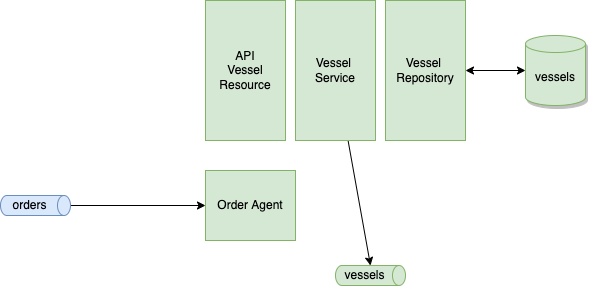

# Vessel Manager Microservice

This project uses Quarkus, see their website: https://quarkus.io/ .

The figure below illustrates the components involved in the code.



## Provided Code

The application exposes an API accessible via Swagger UI: http://localhost:8080/q/swagger-ui to manage the Vessel entity. 

The class [api/VesselResource]() supports the API operations.

The main class supporting the business logic is isolated in the VesselService class. The two main functions are saveVessel and updateVessel to use transaction to save into the Vessel Repository and generate events.

OrderAgent is the consumer, subscribing to orders event topic and then also implementing the logic to process new order and to compensate in case of order onHold.

The event producer and consumer use Reactive messaging and Kafka bindings.

The unit test, assess the generation of events and the order event processing for new order and order onhold event, using reactive messaging InMemeory connector.

Integration tests are done with all the components of the Saga using docker.

## Running the application in dev mode

Start Kafka with docker compose.

You can run the application in dev mode that enables live coding using:

```shell script
./mvnw compile quarkus:dev
```


## Packaging and running the application

The application can be packaged using:

```shell script
./mvnw package
```

It produces the `quarkus-run.jar` file in the `target/quarkus-app/` directory.
Be aware that it’s not an _über-jar_ as the dependencies are copied into the `target/quarkus-app/lib/` directory.

The application is now runnable using `java -jar target/quarkus-app/quarkus-run.jar`.

If you want to build an _über-jar_, execute the following command:
```shell script
./mvnw package -Dquarkus.package.type=uber-jar
```

The application, packaged as an _über-jar_, is now runnable using `java -jar target/*-runner.jar`.

## Creating a native executable

You can create a native executable using: 
```shell script
./mvnw package -Dnative
```

Or, if you don't have GraalVM installed, you can run the native executable build in a container using: 
```shell script
./mvnw package -Dnative -Dquarkus.native.container-build=true
```

You can then execute your native executable with: `./target/vessel-mg-ms-1.0.0-SNAPSHOT-runner`

If you want to learn more about building native executables, please consult https://quarkus.io/guides/maven-tooling.


